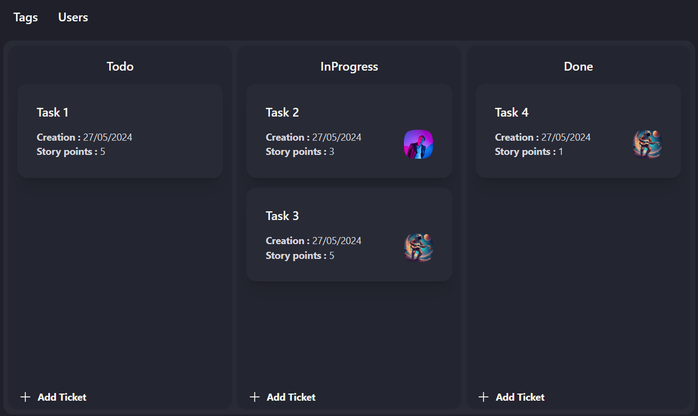

# Simple Kanban

A simple Kanban board [React](https://react.dev/) component that allows you to manage tasks, users & tags, all stored within the browser's local storage. All that through a user-friendly interface made using [Tailwind CSS](https://tailwindcss.com/). Perfect for small projects and personal task management.

## Features



- **Tasks Management**: Create, update, move, and delete tasks with a simple interface
  - 3 Columns layout (TODO, IN PROGRESS, DONE)
  - Drag-and-drop your tasks between columns
  - Link your ticket with a 1-1 parent/child relation
  - Mark a ticket as blocked in the TODO column
- **User Management**: Add, delete, edit users through a data table
  - Manage users' profile pictures
  - Assigne a user to different tasks
- **Tags Management**: Add, delete, edit tags through a data table
  - Manage tags color for easy identification
  - Assigne a tag to different tasks
- **Local Storage**: All data is stored in the browser's local storage

## Installation

Install the component via npm:

```bash
npm install simple-kanban
```

## Usage

Import the component into your React application:

```jsx
import React from 'react';
import { SimpleKanban } from 'simple-kanban';

function App() {
  return (
    <div className="App">
      <SimpleKanban />
    </div>
  );
}

export default App;
```

The `<SimpleKanban />` component is the only one needed to incorporate a simplified Kanban board to your web application.
The component doesn't require any props to function properly.

## Local Storage Structure

To work properly, all the information used and managed by the `<SimpleKanban />` component are stored in the browser's local storage.
The structure of the stored data is as follow:

- **Tags**: Stored under:
  - `kanban-todo-ticket-list`
  - `kanban-in-progress-ticket-list`
  - `kanban-done-ticket-list`
- **Users**: Stored under `kanban-user-list`
- **Images (profile pictures)**: Stored under `kanban-image-list`
- **Tags**: Stored under `kanban-tag-list`

## License

TODO

## Contributing

TODO

## Contact

TODO
